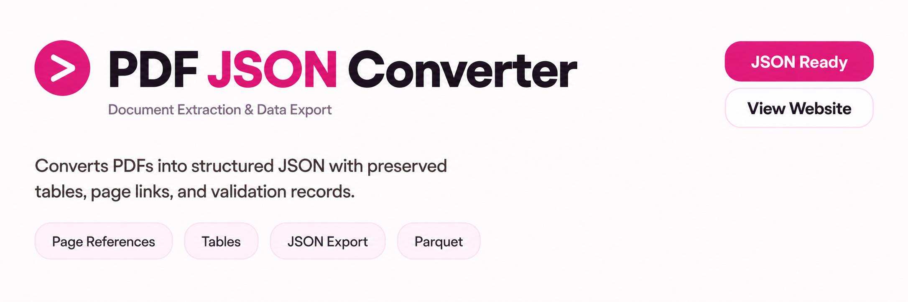
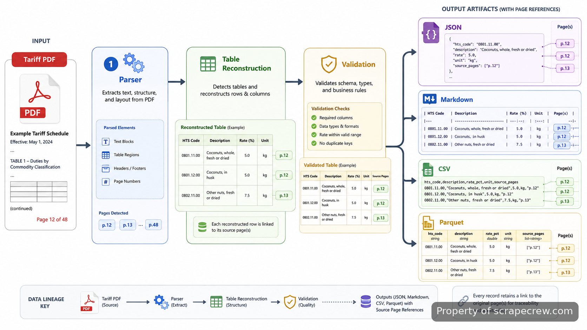
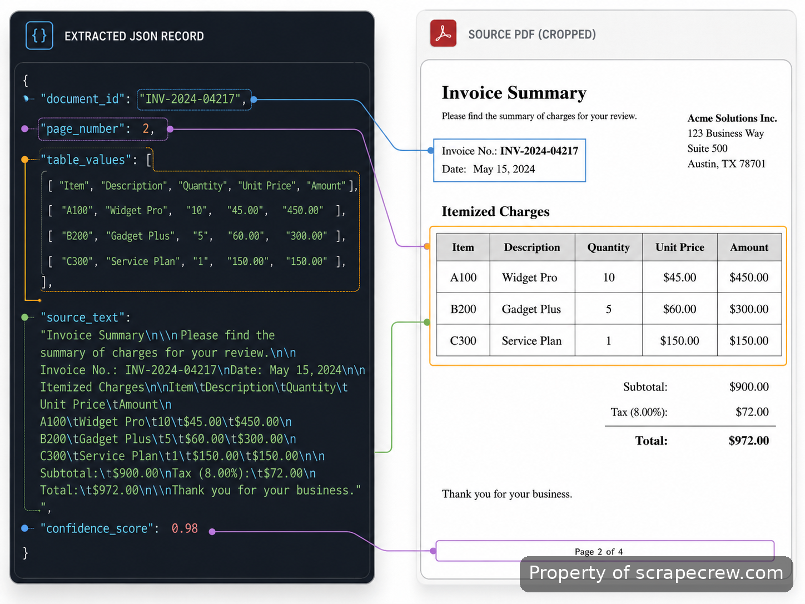
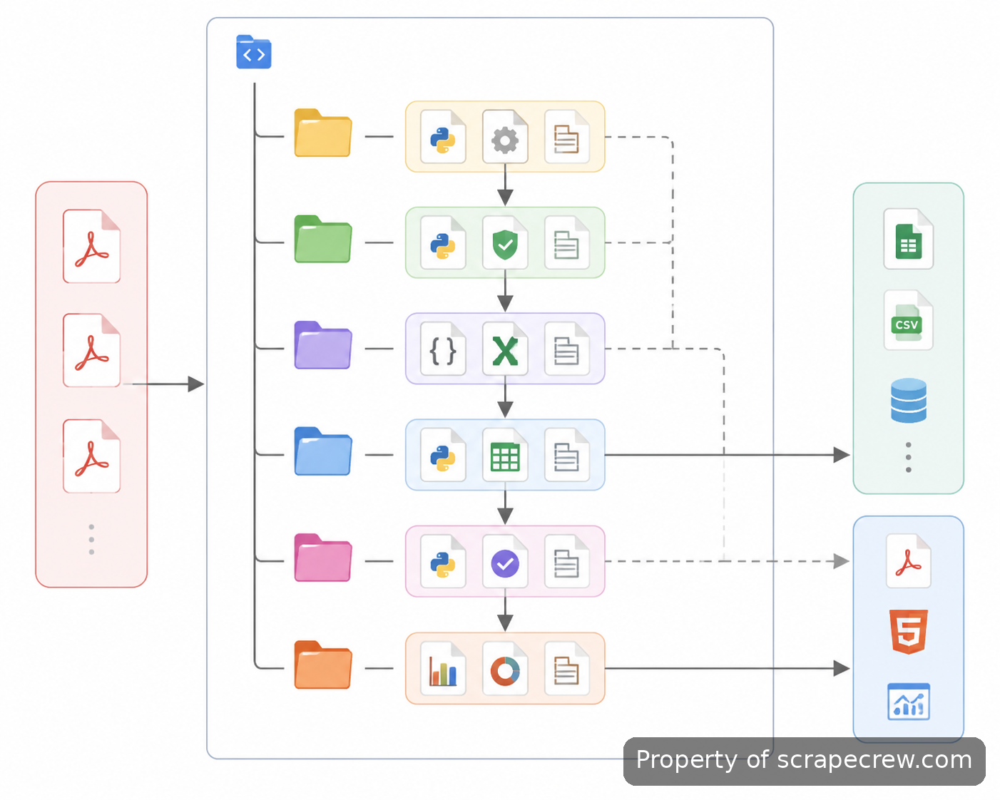
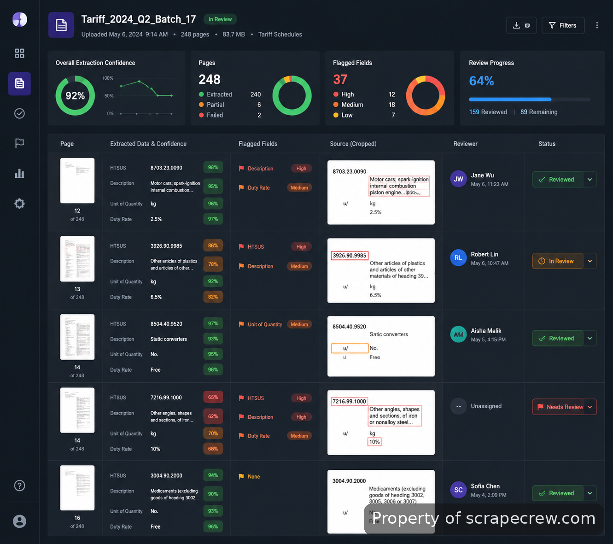

<p align="center">
  <a href="https://www.scrapecrew.com/scraper/pdf-to-json-file-converter-indexing" target="_blank">
    
  </a>
</p>

<p align="center">
  <a href="https://t.me/Bitbash333" target="_blank">
    
  </a>&nbsp;
  <a href="https://wa.me/923249868488?text=Hi%2C%20I%27m%20interested%20in%20ScrapeCrew." target="_blank">
    
  </a>&nbsp;
  <a href="mailto:hello@scrapecrew.com" target="_blank">
    
  </a>&nbsp;
  <a href="https://www.scrapecrew.com" target="_blank">
    
  </a>
</p>

## ScrapeCrew's PDF to JSON File Converter

ScrapeCrew's PDF to JSON File Converter converts large tariff publications into structured datasets while keeping the relationships that make regulatory documents useful. The pipeline preserves headings, table cells, tariff codes, duty percentages, footnotes, and source pages instead of reducing a document to disconnected text.

> A page-linked extraction pipeline with validation records for every uncertain field.



## Preserving document structure during extraction

Regulatory PDFs often contain merged cells, repeated headers, footnotes, and annex references that lose meaning when extracted as plain text. The pipeline creates a page-linked hierarchy where sections contain paragraphs, tables, notes, and references. Each extracted object stores document identifiers, page numbers, coordinates, source text, normalized values, and confidence data.

This model allows analysts to trace a returned value back to the exact source location instead of reopening long publications manually. The ingestion manifest accepts local files and official publication URLs, then records every page outcome during processing.

## Core Features

| Feature | Description |
| --- | --- |
| Page-linked document graph | Missing context makes extracted clauses difficult to verify. Every block keeps page references, coordinates, section paths, and relationships between nearby notes. |
| Native text and OCR routing | Running OCR on clean digital text can introduce errors. The parser checks native content first and uses Amazon Textract only for scanned or complex pages with recorded confidence data. |
| Tariff table reconstruction | Merged cells and repeated headers can place values in the wrong columns. Grid geometry and header rules rebuild table structures before normalization. |
| Numeric validation checks | A single changed digit can alter a tariff interpretation. Pattern checks, column rules, duplicate detection, and comparison passes flag suspicious codes and percentages. |
| Footnote and annex linking | Detached notes can remove important exceptions. Superscripts, labels, and continuation pages are converted into explicit references. |
| Multi-format delivery | Different teams need different outputs. The canonical records export to JSON, Markdown, CSV, and Parquet without separate extraction runs. |



## Document understanding for searchable archives

Search systems need more than extracted sentences. The chunk builder follows headings and table boundaries, keeps citation metadata, and prepares section-aware records for vector search systems. The approach is aligned with research areas such as DocVQA document understanding benchmarks and table structure analysis.

For large analytical workloads, Apache Parquet keeps stable field types and compact column storage. The export layer separates the canonical extraction model from any single search or analytics destination.

## Use Cases

- Regulatory analysts can review tariff publications with source-page references attached to extracted values.
- Data engineers can prepare structured document collections for analytics systems using consistent schemas and Parquet export.
- Search teams can create citation-aware indexes where retrieved sections still point back to original pages.

## Technology Choices Behind the Pipeline

The implementation uses Python orchestration to manage page routing, retries, normalization, and repeatable batch runs. PyMuPDF handles native PDF parsing, page geometry, links, and rendered crops before OCR is considered. Amazon Textract processes scanned pages and complex tables with confidence metadata. Pydantic validates typed records before files are written.

Reference documentation used during implementation includes [PyMuPDF documentation](https://pymupdf.readthedocs.io/), [Amazon Textract developer documentation](https://docs.aws.amazon.com/textract/), [Pydantic documentation](https://docs.pydantic.dev/), and [Apache Parquet documentation](https://parquet.apache.org/docs/).



## Project Directory

```text
tariff-document-processor/
├── src/
│   └── tariff_pipeline/
│       ├── manifest.py
│       ├── page_router.py
│       ├── native_parser.py
│       ├── textract_adapter.py
│       ├── table_rebuilder.py
│       ├── validators.py
│       └── exporters.py
├── config/
│   ├── documents.yaml
│   ├── extraction.yaml
│   └── validation.yaml
├── tests/
│   ├── test_tables.py
│   ├── test_numeric_fields.py
│   └── test_page_lineage.py
└── reports/
    └── quality_summary.html
```

## ScrapeCrew's PDF to JSON File Converter

This repository contains the working extraction pipeline and its repeatable batch process. It can be obtained through [ScrapeCrew's PDF to JSON File Converter](https://www.scrapecrew.com/scraper/pdf-to-json-file-converter-indexing).

### Run a conversion batch

```bash
python -m tariff_pipeline run \
  --manifest config/documents.yaml \
  --output data/exports \
  --report reports/quality_summary.html
```

- **STEP 1 — Download & Set Up the Project** Download and configure [ScrapeCrew's PDF to JSON File Converter](https://www.scrapecrew.com/scraper/pdf-to-json-file-converter-indexing) to access the extraction project.
- **STEP 2 — Load the Manifest** Open the project and provide document sources through the manifest file containing local files or publication URLs.
- **STEP 3 — Review Extraction Settings** Select extraction and validation settings from the YAML configuration files before processing documents.
- **STEP 4 — Run Export Generation** Start the batch command and receive validated JSON, CSV, Markdown, and Parquet outputs.



## Validation Targets

Quality checks reconcile every source page against extraction records or explicit exceptions. Export validation blocks missing identifiers, and fields below 0.92 confidence enter review with source crops and candidate values. Typical processing throughput is 250–500 pages per hour depending on document complexity.

Related work includes custom PDF extraction deployment and ongoing scraper maintenance when a document source or output requirement changes.

## FAQ

### How does the converter preserve tables and page references from regulatory PDFs?

The pipeline stores extracted content as page-linked records instead of isolated text. Tables, notes, headings, coordinates, and source references remain attached so reviewers can trace values back to the original publication.

### Can the exported data be used with vector search systems?

Yes. Section-aware chunks include citation metadata and source references, allowing indexing systems to retrieve document sections while retaining their original page lineage.

### How are uncertain extracted fields reviewed before export?

Fields with confidence below 0.92 are placed into a review queue. Each item includes the affected page region, possible values, validation reasons, and reviewer status rather than only an error message.

<table>
  <tr>
    <td align="center" width="33%">
      
      <p>This scraper helped me gather thousands of posts effortlessly. The setup was fast, and exports are super clean and well-structured.</p>
      <p><b>Nathan Pennington</b><br>Marketer<br>★★★★★</p>
    </td>
    <td align="center" width="33%">
      
      <p>What impressed me most was how accurate the extracted data is. Likes, comments, timestamps — everything aligns perfectly.</p>
      <p><b>Greg Jeffries</b><br>SEO Affiliate Expert<br>★★★★★</p>
    </td>
    <td align="center" width="33%">
      
      <p>It's by far the best tool I've used. Ideal for trend tracking, competitor monitoring, and influencer insights.</p>
      <p><b>Karan</b><br>Digital Strategist<br>★★★★★</p>
    </td>
  </tr>
</table>